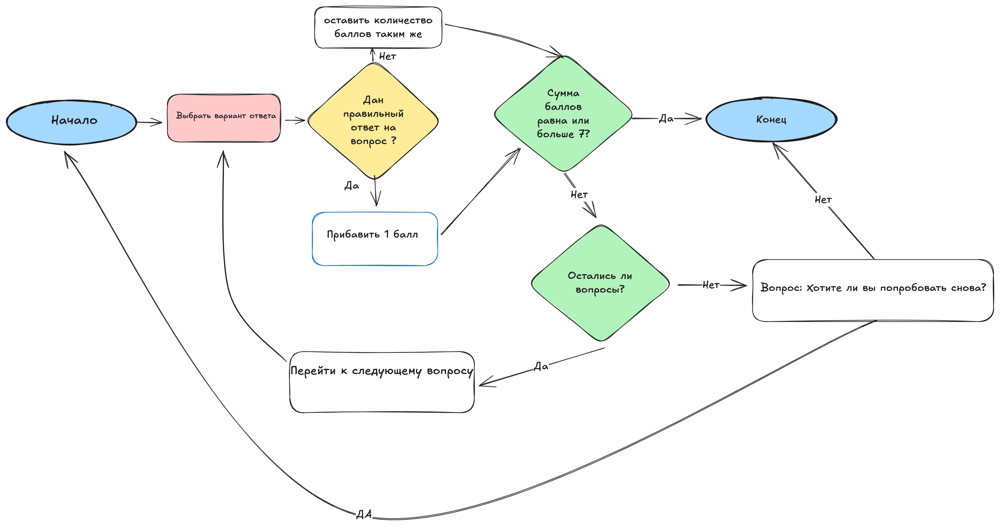
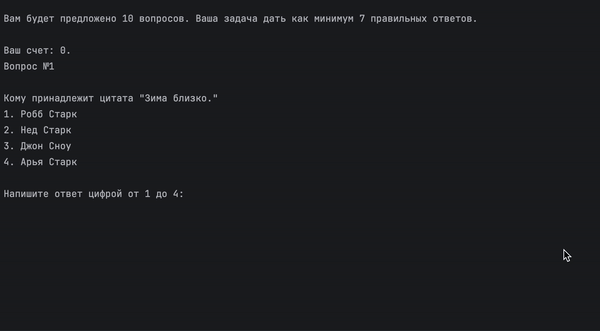
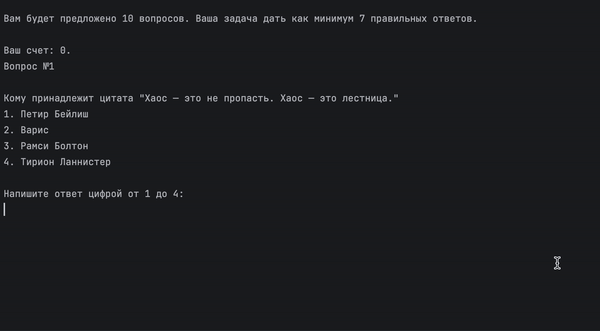

# Python intro ITMO: Первый проект

## Автор
Шадрина Мария Валентиновна 468043

## Описание проекта
Интерактивный квиз: угадай чья цитата "Игра престолов".

Пользователю предлагается 10 вопросов, содержащих 4 варианта ответа.
Если выбирается правильный ответ, то начисляется 1 балл, если нет, то 0. 
Задача набрать 7 баллов. Если набирается данное число, то победа и игра заканчивается. 
Если по окончании всех вопросов человек не набрал 7 баллов, то ему предлагается выбор: заново начать игру или завершить прохождение проигрышем.

## Схема работы

## Пример использования
`python ./got_quiz/main.py`

## Демо
Победа

Поражение

